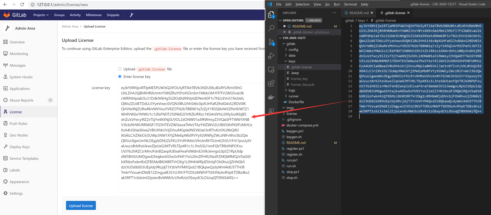

# Gitlab-Docker

> docker 一键部署 Gitlab 破解版

------

## 0x10 环境说明

  


## 0x20 目录结构

```
gitlab-docker
├── README.md ............... [此 README 说明]
├── imgs .................... [辅助 README 说明的图片]
├── gitlab .................. [Gitlab 容器的挂载目录]
│   ├── Dockerfile .......... [Gitlab 的 Docker 构建文件]
│   ├── config .............. [Gitlab 配置挂载目录]
│   ├── data ................ [Gitlab 数据挂载目录]
│   ├── logs ................ [Gitlab 日志挂载目录]
│   ├── keys ................ [Gitlab 破解 License 存储目录]
│   └── nginx ............... [Gitlab 内置 nginx 配置目录（备份配置，勿改）]
├── runner .................. [Gitlab 容器的挂载目录]
├── license ................. [破解 License 的容器构建目录]
│   ├── Dockerfile .......... [License 的 Docker 构建文件]
│   └── license.rb .......... [生成破解 License 的 Ruby 脚本]
├── docker-compose.yml ...... [Docker 的构建配置]
├── keygen.ps1 .............. [Windows: 一键生成破解 License]
├── keygen.sh ............... [Linux:   一键生成破解 License]
├── run.ps1 ................. [Windows: 一键运行 Gitlab 靶场]
├── run.sh .................. [Linux:   一键运行 Gitlab 靶场]
├── register.ps1 ............ [Windows: 一键注册 Runner]
├── register.sh ............. [Linux:   一键注册 Runner]
├── stop.ps1 ................ [Windows: 一键停止 Gitlab 靶场]
└── stop.sh ................. [Linux:   一键停止 Gitlab 靶场]
```


## 0x30 部署说明

### 0x31 构建

- 宿主机预装 docker 和 docker-compose
- 下载本仓库： [git clone https://github.com/lyy289065406/gitlab-docker](https://github.com/lyy289065406/gitlab-docker)
- 生成破解密钥对： [`./keygen.sh`](keygen.sh) 或 [`./keygen.ps1`](keygen.ps1)
- 构建并运行 Gitlab （确保 80 端口未占用）： [`./run.sh`](run.sh) 或 [`./run.ps1`](run.ps1)
- 约 5 分钟后可从浏览器登录 Gitlab：[http://127.0.0.1](http://127.0.0.1) （首次登录需要重设管理员账号 root 的密码）


### 0x32 破解

前面生成破解密钥对的时候，已经把公钥写入 Gitlab 容器后台了，还需要把私钥通过前端上传到 Gitlab 完成破解：

- 密钥对生成到 [`./gitlab/keys/`](gitlab/keys/) 目录，复制其下 `.gitlab-license` 的内容（私钥）
- 使用 root 用户打开 [http://127.0.0.1/admin/license/new](http://127.0.0.1/admin/license/new) 页面
- 选择 `Enter license key` 并粘贴私钥，点击 `Upload license` 按钮即可完成破解





### 0x33 设置 Runner

- 使用 root 用户打开 [http://127.0.0.1/admin/runners](http://127.0.0.1/admin/runners) 页面
- 找到 registration token 并复制
- 注册 Runner： [`./register.sh $TOKEN`](register.sh) 或 [`./register.ps1 $TOKEN`](register.ps1)

> 至此所有 Repository 都可以使用此 Runner 执行 CI 脚本（Pipeline Jobs）


### 0x34 访问 Gitlab Pages

假设你的 Gitlab 用户名为 `${username}`，仓库名称为 `${repository_name}`，当仓库已经使用 jekyll 成功构建 SSG 后，只需要访问以下 URL 即可：

[http://127.0.0.1:8000/${username}/${repository_name}/public/](http://127.0.0.1:8000)


